# MOR — 月度業績預估工具

MOR 是一套本地端 Flask 應用程式，用於月度銷售業績預估。它讀取 Excel 業績明細檔案，依據歷史訂單週期自動估算各客戶 / 產品的下月需求量，並提供即時手動調整與排除機制，最終匯出完整預估 Excel 報表。

## 功能摘要

- **自動預估**：依據客戶 × 商品歷史叫貨週期，自動判斷該品項是否在目標月份到期，並計算預估數量。
- **手動覆寫與快照**：在瀏覽器表格中修改預估數量、填寫備註、停用品項，並儲存草稿 / 定稿快照。
- **Excel 匯出**：一鍵匯出含「預估總覽」「預估明細」「排除明細」三個工作表的 `.xlsx` 報表。
- **同期與預算比對**：同時顯示去年同月、今年同月、上月表現、預算目標與 GAP。
- **跳單監控**：產品監控頁整合當月累積業績、月底推估、週期延遲、同期差異與預算達成率。
- **結月檢討**：匯入每日業績、結月後鎖定實績與快照，並在月底檢討頁比較實績、預估、預算與去年同期。
- **資料檢核**：設定頁集中管理品項規則，並顯示預算缺漏、零單價、去年同期缺資料等健康檢查。

## 目前架構狀態（2026-05-24）

- MOR 目前是 Flask + Jinja + vanilla JS 的本地操作型工作台，資料密度與表格操作優先。
- `src/backend/app.py` 是主要路由編排層；預估、呈現、匯入、快照、結月與檢討邏輯已拆到 backend service。
- `mor_workbench.db` 是目前工作台狀態中心，保存歷史業績、當月累積、預算、品項規則、人工調整、快照、每日實績與結月紀錄。
- 主流程由 `forecast_workbench_context.py` 組合 SQLite、預估引擎、歷史補值、預算、每日實績與月底推估，產生 `ForecastPageContext` / `ForecastSummary`。
- `operational_views.py` 保留 Dashboard、產品監控、資料健康與 analytics 的共用呈現模型；Dashboard 模板資料再由 `dashboard_analytics_workflow.py` 組裝。
- 調整與匯出流程已拆成 `forecast_write_workflow.py` 與 `forecast_export_workflow.py`，讓 route 只負責驗證、呼叫 service、回應頁面或檔案。
- 目前後續工作以 `ROADMAP.md` 為準；修改 UI、預估規則或 Excel schema 時需同步更新對應 docs。

## 系統架構

此架構圖反映目前實作狀態。Excel 與上傳檔先經 ETL / importer 寫入 SQLite；`forecast_workbench_context.py` 再把預估、預算、品項設定、每日實績、歷史補值與工作日資料組成頁面上下文。Flask route 保持薄層，負責導頁、表單解析、服務呼叫與回應。

```mermaid
flowchart TD
    browser["Browser UI"]

    subgraph web["Web Layer"]
        entry["app.py<br/>啟動入口"]
        flask["src/backend/app.py<br/>Flask routes"]
        templates["templates/<br/>Jinja pages"]
        static["static/<br/>CSS + vanilla JS"]
        parser["web/form_parser.py<br/>表單解析"]
        presenter["web/forecast_presenter.py<br/>預估表格呈現"]
        writeflow["forecast_write_workflow.py<br/>列調整儲存"]
        exportflow["forecast_export_workflow.py<br/>匯出前整理"]
    end

    subgraph sources["Input Sources"]
        historical["業績明細 Excel<br/>月底確定歷史業績"]
        budget["2026 預算 Excel"]
        shpb["SHPB / 每日業績上傳<br/>當月累積實績"]
    end

    subgraph data["Data + Persistence"]
        etl["etl.py<br/>業績 / 預算同步"]
        daily["daily_sales_importer.py<br/>每日業績匯入 / 結月"]
        loader["data_loader.py<br/>Excel + DB 合併載入"]
        validator["data_validator.py<br/>資料檢核"]
        db["database.py<br/>mor_workbench.db"]
        history["history_service.py / snapshot_service.py<br/>歷史補值與預估快照"]
        calendar["workday_calendar.py<br/>台灣工作日"]
    end

    subgraph core["Core Forecast Logic"]
        engine["forecast_engine.py<br/>預估計算"]
        context["forecast_workbench_context.py<br/>頁面上下文組裝"]
        projection["projection_engine.py<br/>月底量推估"]
        models["forecast_models.py<br/>資料模型"]
        config["forecast_config.py<br/>檔名 / 欄位 / 參數"]
    end

    subgraph ops_layer["Operational + Review"]
        ops["operational_views.py<br/>Dashboard / Monitor / Settings"]
        dashboardflow["dashboard_analytics_workflow.py<br/>Dashboard 模板資料"]
        analytics["analytics.py<br/>年度 / 客戶 / 品項分析"]
        review["monthly_review.py<br/>結月後檢討"]
    end

    subgraph output["Output"]
        exporter["exporter.py<br/>Excel 匯出"]
        workbook["預估 Excel workbook"]
    end

    subgraph test_layer["Testing"]
        tests["tests/<br/>單元與路由測試"]
    end

    browser --> flask
    entry --> flask

    flask --> templates
    flask --> static
    flask --> parser
    flask --> presenter
    flask --> context
    flask --> ops
    flask --> dashboardflow
    flask --> review
    flask --> daily
    flask --> history
    flask --> writeflow
    flask --> exportflow
    flask --> exporter

    historical --> loader
    historical --> etl
    budget --> etl
    shpb --> etl
    shpb --> daily
    etl --> db
    daily --> db
    db --> loader
    loader --> validator
    loader --> engine

    engine --> models
    engine --> config
    engine --> history
    context --> loader
    context --> engine
    context --> ops
    context --> daily
    context --> history
    context --> projection
    projection --> calendar

    ops --> loader
    ops --> engine
    ops --> projection
    ops --> history
    ops --> analytics
    ops --> validator
    ops --> db
    dashboardflow --> ops
    dashboardflow --> analytics
    review --> db

    writeflow --> db
    exportflow --> engine
    exporter --> workbook
    exporter --> models

    tests --> flask
    tests --> engine
    tests --> parser
    tests --> presenter
```



## 環境需求

| 項目 | 版本 |
| --- | --- |
| Python | 3.10+ |
| 作業系統 | Windows（主要）；其他平台亦可 |

### 相依套件

```
Flask
Flask-Caching
pandas
openpyxl
xlsxwriter
pytest
```

## 快速開始

### 1. 安裝相依套件

```powershell
python -m pip install -r requirements.txt
```

### 2. 放置業績明細

將 Excel 業績明細檔案放在專案根目錄，檔名需與 `forecast_config.py` 中的 `detail_file` 設定一致（預設為 `業績明細202401-20260430-George.xlsx`）。

Excel 檔案須包含工作表 `業績明細`，且至少包含以下欄位：

| 必要欄位 |
| --- |
| 年 |
| 月 |
| 日 |
| 客戶簡稱 |
| 商品號 |
| 商品簡稱 |
| 銷+贈S量 |
| 單價NT(淨) |
| 含稅總額(淨) |

預算檔與每日業績 / SHPB 上傳檔會透過頁面操作或 `/sync` 寫入 `mor_workbench.db`；本地 `.xlsx` 來源資料請視為輸入，不要直接覆寫。

### 3. 啟動應用

```powershell
python app.py
```

應用預設運行於 `http://127.0.0.1:5000`。

### 4. 使用流程

1. 開啟首頁 `/` 查看業績總覽 Dashboard。
2. 透過頁面上方的年 / 月控制項切換預估目標月份。
3. 進入 `/monitor/products` 匯入當月累積業績、檢查跳單風險，月底可結月。
4. 進入 `/forecast` 修改預估數量、追蹤備註、儲存快照，並匯出 Excel。
5. 進入 `/settings` 管理品項規則並檢查預算與訂單資料。
6. 進入 `/monthly-review` 查看已結月月份的實績、預估、預算與去年同期檢討。

### 5. 預算比較規則

- 達成率 = 最終預估 / 預算目標 * 100。
- GAP / 差異 = 最終預估 - 預算目標。
- 上月達成率與上月 GAP 則使用上月實績與上月預算比較。
- Dashboard 整體總覽只顯示金額；數量只用於產品監控、預估調整與品項分析。
- Dashboard 金額目標優先使用預算檔 `04預算總額`；只有舊資料沒有金額欄位時才暫以預算量 * 最新單價估算。
- Dashboard 目前實績金額、預估月底金額與預估調整總額統一使用銷售明細的最新單價 `單價NT(淨)`。
- 產品與品項視角的數量目標使用與預估明細 `銷+贈S量` 同口徑的 `07預算S總量`；`02預算總量` 保留為總量口徑，不混入 S量比較。
- Dashboard 達成率與 GAP 只納入有預算目標的列；缺預算列保留在資料檢核，不放大分子。
- 產品跳單高風險 = 預估月底數量低於去年同期數量 10% 以上。

## 專案結構

```mermaid
flowchart TD
    root["MOR 專案根目錄"]
    root --> app_py["app.py<br/>Flask 啟動包裝"]
    root --> backend["src/backend<br/>核心後端邏輯"]
    root --> web["src/backend/web<br/>表單與表格呈現"]
    root --> templates_dir["templates<br/>多頁操作介面"]
    root --> static_dir["static<br/>CSS 與小型 JS 模組"]
    root --> tests_dir["tests<br/>回歸測試"]
    root --> docs["docs<br/>架構、ADR、設計、工作流程、驗證文件"]
    root --> config_files["README.md / ROADMAP.md / DESIGN.md / AGENTS.md<br/>專案與開發指引"]
    root --> req["requirements.txt<br/>Python 相依套件"]

    backend --> backend_routes["app.py<br/>路由編排"]
    backend --> backend_data["data_loader.py / etl.py / data_validator.py<br/>資料載入、轉換、檢核"]
    backend --> backend_forecast["forecast_engine.py / forecast_models.py / forecast_config.py<br/>預估規則、模型、設定"]
    backend --> backend_context["forecast_workbench_context.py<br/>預估工作台上下文組裝"]
    backend --> backend_workflows["forecast_write_workflow.py / forecast_export_workflow.py / dashboard_analytics_workflow.py<br/>寫入、匯出、Dashboard 模板流程"]
    backend --> backend_ops["operational_views.py / analytics.py<br/>Dashboard、監控、設定與分析服務"]
    backend --> backend_history["database.py / history_service.py / snapshot_service.py<br/>SQLite、歷史紀錄與快照"]
    backend --> backend_import["daily_sales_importer.py / workday_calendar.py<br/>每日業績、結月與工作日"]
    backend --> backend_review["projection_engine.py / monthly_review.py<br/>月底推估與結月檢討"]
    backend --> backend_export["exporter.py<br/>匯出 workbook"]
    backend --> backend_compat["sales_forecast.py<br/>相容 facade"]

    web --> form_parser["form_parser.py"]
    web --> forecast_presenter["forecast_presenter.py"]

    templates_dir --> dashboard_tpl["index.html"]
    templates_dir --> forecast_tpl["forecast.html"]
    templates_dir --> monitor_tpl["product_monitor.html"]
    templates_dir --> settings_tpl["settings.html"]
    templates_dir --> review_tpl["monthly_review.html"]
    templates_dir --> items_tpl["items.html"]
    templates_dir --> partials["_header.html / _dashboard_metrics.html / _forecast_row.html"]

    static_dir --> css["css/mor.css"]
    static_dir --> js["js/forecast-table.js / monitor-table.js / item-settings.js / analytics-renderer.js"]

    docs --> workflow_docs["workflows<br/>Codex 與操作流程"]
    docs --> design_docs["design<br/>資料模型、API、預估邏輯"]
    docs --> arch_docs["architecture<br/>專題架構紀錄"]
    docs --> adr_docs["adr<br/>架構決策"]
    docs --> verification_docs["verification<br/>瀏覽器驗證紀錄"]
```



```text
app.py                         Flask 應用入口
src/backend/                   核心預估與業務邏輯
  app.py                       Flask 路由
  forecast_config.py           集中管理檔名、工作表、必要欄位、列數上限
  forecast_models.py           ForecastTarget, ForecastRow, ForecastSummary 資料模型
  database.py                  SQLite schema 與連線工廠
  data_loader.py               Excel 載入、DB 當月資料合併與 DataFrame 前處理
  etl.py                       業績明細、預算與 SHPB 同步
  daily_sales_importer.py      每日業績匯入、累積實績與結月
  data_validator.py            資料健康檢查
  forecast_engine.py           預估計算核心邏輯
  forecast_workbench_context.py 預估頁面上下文組裝，串接 DB、預估、預算、實績、歷史與推估
  forecast_write_workflow.py    人工調整數量與備註寫入流程
  forecast_export_workflow.py   匯出前套用送出狀態、備註與金額重算
  dashboard_analytics_workflow.py Dashboard 模板資料與 analytics 區塊組裝
  projection_engine.py         基於工作日週期的月底量推估
  operational_views.py         Dashboard、跳單監控、設定、analytics 共用呈現服務
  analytics.py                 年度 / 客戶 / 品項分析資料結構
  history_service.py           上月表現與 6M 趨勢補值
  snapshot_service.py          預估草稿 / 定稿快照
  monthly_review.py            結月後檢討服務
  workday_calendar.py          台灣工作日資料與工作日統計
  exporter.py                  Excel 報表匯出
  sales_forecast.py            向後相容用的 Facade
  web/form_parser.py           表單解析與驗證
  web/forecast_presenter.py    預估表格序列化
templates/index.html           業績總覽 Dashboard
templates/forecast.html        預估調整與匯出工作台
templates/product_monitor.html 產品跳單監控頁
templates/settings.html        系統設定 / 資料檢核頁
templates/monthly_review.html  結月後檢討頁
static/                        靜態資源
tests/                         單元測試與路由測試
docs/workflows/                目前 Codex 與本地操作流程
docs/design/                   前端 / 資料模型 / 預估邏輯參考文件
docs/architecture/             專題架構紀錄
docs/adr/                      架構決策紀錄
DESIGN.md                      UI 設計系統規範
AGENTS.md                      AI Agent 開發指引
requirements.txt               Python 相依清單
```

## 預估邏輯說明

1. **分組**：依 `客戶簡稱` × `商品號` 分組。
2. **週期計算**：取每組歷史叫貨日間隔平均值（排除超過 `max_cycle_interval_days` 的間隔，預設 120 天）。
3. **下次叫貨日推估**：最近叫貨日 + 平均週期天數。
4. **自動預估判定**：若推估叫貨日落在目標月份範圍內，標記為 `本月可能跳單`（`auto_in_month`），否則標記 `未到週期`。
5. **數量估算**：取近期歷史來源平均，目前包含上月數量與近 3 個月平均；去年同期數量只作為風險比較，不進入自動預估來源。
6. **當月實績與月底推估**：每日業績匯入後，產品監控使用工作日週期、剩餘工作日與典型出貨量推估月底數量。
7. **金額計算**：有效預估數量 × 最近單價；Dashboard 金額視角以金額目標與最新單價口徑呈現。
8. **手動調整**：使用者可覆寫數量或排除品項，排除後金額歸零。
9. **快照與結月**：草稿 / 定稿快照保存預估版本；結月後月底檢討改由 DB 中的實績、快照、預算與去年資料產生。

## 測試

```powershell
python -m pytest -q
```

測試涵蓋：

- `tests/test_forecast.py` — 預估引擎核心邏輯
- `tests/test_app.py` — Flask 路由行為
- `tests/test_etl.py` / `tests/test_current_month_integration.py` — Excel / SHPB 同步與當月資料合併
- `tests/test_daily_sales_importer.py` — 每日業績匯入與結月
- `tests/test_operational_views.py` / `tests/test_dashboard_analytics_workflow.py` — Dashboard、監控、analytics 與資料健康上下文
- `tests/test_projection_engine.py` / `tests/test_workday_calendar.py` — 月底推估與工作日計算
- `tests/test_snapshot_service.py` / `tests/test_monthly_review.py` — 預估快照與結月後檢討
- `tests/test_form_parser.py` — 表單解析
- `tests/test_forecast_presenter.py` — 預估資料呈現

## 匯出報表格式

匯出的 Excel 包含三個工作表：

| 工作表 | 內容 |
| --- | --- |
| 預估總覽 | 預估月份、總金額、列入 / 排除品項數 |
| 預估明細 | 所有品項的完整預估欄位 |
| 排除明細 | 僅列出被排除的品項 |

## 設計原則

- **精簡路由**：Flask route 僅做流程編排，不含預估數學。
- **可測試性**：預估邏輯可脫離 Flask 獨立測試。
- **集中配置**：Excel 欄位與檔案路徑集中於 `forecast_config.py`。
- **表格優先的 UI**：介面以資料密度為導向，不使用行銷式裝飾。詳見 [DESIGN.md](DESIGN.md)。

## 開發指引

- 遵循 Conventional Commits：`<type>(scope): <message>`。
- 修改預估邏輯或 Excel 格式後，務必更新對應文件。
- 新增第三方套件需經核准，並更新 `requirements.txt`。
- 詳細的 AI Agent 開發規範請參考 [AGENTS.md](AGENTS.md)。

## License

Internal use only.
