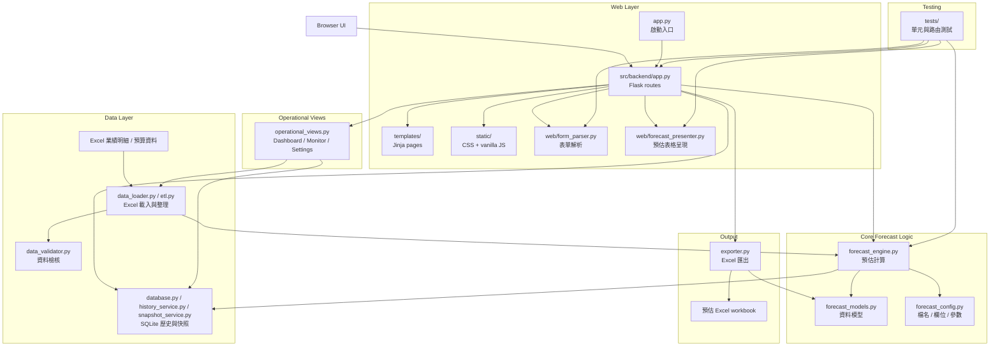

# MOR — 月度業績預估工具

MOR 是一套本地端 Flask 應用程式，用於月度銷售業績預估。它讀取 Excel 業績明細檔案，依據歷史訂單週期自動估算各客戶 / 產品的下月需求量，並提供即時手動調整與排除機制，最終匯出完整預估 Excel 報表。

## 功能摘要

- **自動預估**：依據客戶 × 商品歷史叫貨週期，自動判斷該品項是否在目標月份到期，並計算預估數量。
- **手動覆寫**：在瀏覽器表格中直接修改預估數量，或勾選排除特定品項。
- **Excel 匯出**：一鍵匯出含「預估總覽」「預估明細」「排除明細」三個工作表的 `.xlsx` 報表。
- **同期比對**：同時顯示去年同月及今年同月實際數量，輔助判斷。
- **週期計算**：自動計算平均叫貨週期（上限可配置），推估下次叫貨日。

## 系統架構

此架構圖將 MOR 分為 Web Layer、Data Layer、Core Forecast Logic、Operational Views、Output 與 Testing 六個區塊。資料由 Excel 來源匯入後，經由 loader 整理並提供給資料檢核與 forecast_engine 預估計算。Flask 作為主要後端入口，負責串接頁面呈現、表單解析、歷史快照、Dashboard 與 Excel 匯出功能。



## 環境需求

| 項目 | 版本 |
| --- | --- |
| Python | 3.10+ |
| 作業系統 | Windows（主要）；其他平台亦可 |

### 相依套件

```
Flask
pandas
openpyxl
xlsxwriter
pytest
```

## 快速開始

### 1. 安裝相依套件

```powershell
python -m pip install -r requirements.txt
```

### 2. 放置業績明細

將 Excel 業績明細檔案放在專案根目錄，檔名需與 `forecast_config.py` 中的 `detail_file` 設定一致（預設為 `業績明細202401-20260430-George.xlsx`）。

Excel 檔案須包含工作表 `業績明細`，且至少包含以下欄位：

| 必要欄位 |
| --- |
| 年 |
| 月 |
| 日 |
| 客戶簡稱 |
| 商品號 |
| 商品簡稱 |
| 銷+贈S量 |
| 單價NT(淨) |

### 3. 啟動應用

```powershell
python app.py
```

應用預設運行於 `http://127.0.0.1:5000`。

### 4. 使用流程

1. 開啟首頁 `/` 查看業績總覽 Dashboard。
2. 透過頁面上方的年 / 月控制項切換預估目標月份。
3. 進入 `/monitor/products` 每天查看低於去年同期 10% 以上的產品跳單風險。
4. 進入 `/forecast` 直接修改預估數量、追蹤備註，並匯出 Excel。
5. 進入 `/settings` 管理品項規則並檢查預算與訂單資料。

### 5. 預算比較規則

- 達成率 = 最終預估 / 預算目標 * 100。
- GAP / 差異 = 最終預估 - 預算目標。
- 上月達成率與上月 GAP 則使用上月實績與上月預算比較。
- Dashboard 整體總覽只顯示金額；數量只用於產品監控、預估調整與品項分析。
- Dashboard 金額目標優先使用預算檔 `04預算總額`；只有舊資料沒有金額欄位時才暫以預算量 * 最新單價估算。
- Dashboard 目前實績金額、預估月底金額與預估調整總額統一使用銷售明細的最新單價 `單價NT(淨)`。
- 產品與品項視角的數量目標使用與預估明細 `銷+贈S量` 同口徑的 `07預算S總量`；`02預算總量` 保留為總量口徑，不混入 S量比較。
- Dashboard 達成率與 GAP 只納入有預算目標的列；缺預算列保留在資料檢核，不放大分子。
- 產品跳單高風險 = 預估月底數量低於去年同期數量 10% 以上。

## 專案結構

```mermaid
flowchart TD
    root["MOR 專案根目錄"]
    root --> app_py["app.py<br/>Flask 啟動包裝"]
    root --> backend["src/backend<br/>核心後端邏輯"]
    root --> web["src/backend/web<br/>表單與表格呈現"]
    root --> templates_dir["templates<br/>多頁操作介面"]
    root --> static_dir["static<br/>CSS 與小型 JS 模組"]
    root --> tests_dir["tests<br/>回歸測試"]
    root --> infra["infrastructure<br/>架構、ADR、規劃文件"]
    root --> docs["docs<br/>設計、工作流程、驗證文件"]
    root --> config_files["README.md / ROADMAP.md / DESIGN.md / AGENTS.md<br/>專案與開發指引"]
    root --> req["requirements.txt<br/>Python 相依套件"]

    backend --> backend_routes["app.py<br/>路由編排"]
    backend --> backend_data["data_loader.py / etl.py / data_validator.py<br/>資料載入、轉換、檢核"]
    backend --> backend_forecast["forecast_engine.py / forecast_models.py / forecast_config.py<br/>預估規則、模型、設定"]
    backend --> backend_ops["operational_views.py<br/>Dashboard、監控、設定資料服務"]
    backend --> backend_history["database.py / history_service.py / snapshot_service.py<br/>歷史紀錄與快照"]
    backend --> backend_export["exporter.py<br/>匯出 workbook"]
    backend --> backend_compat["sales_forecast.py<br/>相容 facade"]

    web --> form_parser["form_parser.py"]
    web --> forecast_presenter["forecast_presenter.py"]

    templates_dir --> dashboard_tpl["index.html"]
    templates_dir --> forecast_tpl["forecast.html"]
    templates_dir --> monitor_tpl["product_monitor.html"]
    templates_dir --> settings_tpl["settings.html"]
    templates_dir --> items_tpl["items.html"]
    templates_dir --> partials["_header.html / _dashboard_metrics.html / _forecast_row.html"]

    static_dir --> css["css/mor.css"]
    static_dir --> js["js/forecast-table.js / monitor-table.js / item-settings.js"]

    docs --> workflow_docs["workflows<br/>Codex 與操作流程"]
    docs --> design_docs["design<br/>資料模型、API、預估邏輯"]
    docs --> arch_docs["architecture<br/>路徑與架構文件"]
    docs --> verification_docs["verification<br/>瀏覽器驗證紀錄"]

    infra --> adr["adr<br/>架構決策"]
    infra --> plans["plans<br/>實作與路線規劃"]
    infra --> api["api<br/>API 規格"]
    infra --> standards["standards<br/>Git workflow"]
```



```text
app.py                         Flask 應用入口
src/backend/                   核心預估與業務邏輯
  app.py                       Flask 路由
  forecast_config.py           集中管理檔名、工作表、必要欄位、列數上限
  forecast_models.py           ForecastTarget, ForecastRow, ForecastSummary 資料模型
  data_loader.py               Excel 載入與 DataFrame 前處理
  forecast_engine.py           預估計算核心邏輯
  operational_views.py         Dashboard、跳單監控、資料檢核共用呈現服務
  exporter.py                  Excel 報表匯出
  sales_forecast.py            向後相容用的 Facade
  web/form_parser.py           表單解析與驗證
templates/index.html           業績總覽 Dashboard
templates/forecast.html        預估調整與匯出工作台
templates/product_monitor.html 產品跳單監控頁
templates/settings.html        系統設定 / 資料檢核頁
static/                        靜態資源
tests/                         單元測試與路由測試
docs/architecture/             架構文件
docs/design/                   前端 / 設計系統文件
docs/workflows/                工作流程文件
docs/roadmaps/                 產品路線圖
DESIGN.md                      UI 設計系統規範
AGENTS.md                      AI Agent 開發指引
requirements.txt               Python 相依清單
```

## 預估邏輯說明

1. **分組**：依 `客戶簡稱` × `商品號` 分組。
2. **週期計算**：取每組歷史叫貨日間隔平均值（排除超過 `max_cycle_interval_days` 的間隔，預設 120 天）。
3. **下次叫貨日推估**：最近叫貨日 + 平均週期天數。
4. **自動預估判定**：若推估叫貨日落在目標月份範圍內，標記為 `本月可能跳單`（`auto_in_month`），否則標記 `未到週期`。
5. **數量估算**：取近期歷史來源平均，目前包含上月數量與近 3 個月平均；去年同期數量只作為風險比較，不進入自動預估來源。
6. **金額計算**：有效預估數量 × 最近單價。
7. **手動調整**：使用者可覆寫數量或排除品項，排除後金額歸零。

## 測試

```powershell
python -m pytest -q
```

測試涵蓋：

- `tests/test_forecast.py` — 預估引擎核心邏輯
- `tests/test_app.py` — Flask 路由行為
- `tests/test_form_parser.py` — 表單解析
- `tests/test_forecast_presenter.py` — 預估資料呈現

## 匯出報表格式

匯出的 Excel 包含三個工作表：

| 工作表 | 內容 |
| --- | --- |
| 預估總覽 | 預估月份、總金額、列入 / 排除品項數 |
| 預估明細 | 所有品項的完整預估欄位 |
| 排除明細 | 僅列出被排除的品項 |

## 設計原則

- **精簡路由**：Flask route 僅做流程編排，不含預估數學。
- **可測試性**：預估邏輯可脫離 Flask 獨立測試。
- **集中配置**：Excel 欄位與檔案路徑集中於 `forecast_config.py`。
- **表格優先的 UI**：介面以資料密度為導向，不使用行銷式裝飾。詳見 [DESIGN.md](DESIGN.md)。

## 開發指引

- 遵循 Conventional Commits：`<type>(scope): <message>`。
- 修改預估邏輯或 Excel 格式後，務必更新對應文件。
- 新增第三方套件需經核准，並更新 `requirements.txt`。
- 詳細的 AI Agent 開發規範請參考 [AGENTS.md](AGENTS.md)。

## License

Internal use only.
