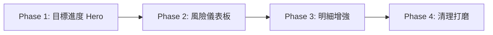

# MOR Dashboard 階段性改善計畫

> 基於 [dashboard_redesign.md](file:///C:/Users/User/.gemini/antigravity/brain/9bf04000-de28-4add-b603-02408c0e0e29/artifacts/dashboard_redesign.md) 的方案，拆分為 4 個可獨立交付的 Phase。

---

## Phase 1 — 目標進度 Hero（核心體感升級）

> **目標：** 讓業務一眼看到「我離目標多遠」
> **預估：** 30-40 分鐘

### 變更範圍

| 檔案 | 變更 |
|------|------|
| `templates/index.html` | 重構 metric 區：Hero progress bar + 3 個子指標 + 剩餘天數 |
| `static/css/mor.css` | 新增 `.progress-hero`, `.progress-bar`, `.sub-metrics` 樣式 |
| `src/backend/app.py` | dashboard route 傳入 `remaining_days` |

### 具體工作

- [x] **1.1** 計算 `remaining_days` = 月底日期 - 今天，傳入 template
- [x] **1.2** 重構 Zone 1 HTML：
  - 大 progress bar（寬度 = 達成率%）
  - 達成率大字顯示，帶條件色（≥100% 綠 / 90-99% 黃 / <90% 紅）
  - 下方三格子指標：目前實績、預估新增（forecast - actual）、GAP
- [x] **1.3** 移除原本平鋪的 7 張 metric card
- [x] **1.4** CSS：progress bar 動畫、條件色 class、子指標排版
- [x] **1.5** 語法檢查 + 瀏覽器驗證（46 tests pass）

### 驗收標準
- 進度條顏色隨達成率自動變化
- 三個子指標數字正確對齊
- 剩餘天數正確顯示

---

## Phase 2 — 風險儀表板（客戶維度 + 狀態分佈）

> **目標：** 讓業務知道「該擔心哪些客戶」
> **預估：** 40-60 分鐘

### 變更範圍

| 檔案 | 變更 |
|------|------|
| `src/backend/operational_views.py` | 新增 `build_customer_risk_ranking()` + `build_status_distribution()` |
| `src/backend/app.py` | dashboard route 傳入新聚合資料 |
| `templates/index.html` | Zone 2：左側狀態分佈 + 右側客戶 Top 5 |
| `static/css/mor.css` | 新增 `.risk-summary`, `.customer-rank`, inline bar 樣式 |

### 具體工作

- [x] **2.1** 後端：從 `monitor_rows` 聚合狀態分佈
- [x] **2.2** 後端：從 `monitor_rows` 按客戶聚合 GAP（加入 `latest_price` 和 `amount_impact` 到 `ProductMonitorRow`）
- [x] **2.3** 前端 HTML：左 1/3 狀態分佈卡片 + 右 2/3 客戶排名
- [x] **2.4** CSS：狀態 dot indicator、inline bar chart（純 CSS）
- [x] **2.5** pytest 驗證（46 tests pass）
- [x] **2.6** 瀏覽器驗證

### 驗收標準
- 狀態分佈數字加總 = 總品項數
- 客戶排名按 GAP 金額降序
- Inline bar 寬度比例正確

---

## Phase 3 — 高風險明細增強

> **目標：** 讓業務有明確的「下一步行動」
> **預估：** 20-30 分鐘

### 變更範圍

| 檔案 | 變更 |
|------|------|
| `templates/index.html` | 明細表增加「金額影響」欄 + 行內跳轉 + 排序改變 |
| `src/backend/app.py` | dashboard route 排序改為按金額影響 |
| `static/css/mor.css` | 行內按鈕樣式微調 |

### 具體工作

- [x] **3.1** 增加 `amount_impact` 到 monitor row（已在 Phase 2 完成，加入 `latest_price` 和 `amount_impact` 到 `ProductMonitorRow`）
- [x] **3.2** 前端表頭新增「金額影響」欄
- [x] **3.3** 排序改為 `amount_impact` 降序（金額影響最大的排最前）
- [x] **3.4** 每行末尾加「→」按鈕，href 到 `/forecast?year=X&month=Y#row-{row_id}`
- [x] **3.5** 顯示筆數從 10 增加到 15
- [x] **3.6** pytest 驗證（46 tests pass）

### 驗收標準
- 金額影響欄數字 = 差異 × 單價
- 表格按金額影響排序
- 「→」點擊可跳轉

---

## Phase 4 — 清理與打磨

> **目標：** 移除噪音、完善細節
> **預估：** 15-20 分鐘

### 變更範圍

| 檔案 | 變更 |
|------|------|
| `templates/index.html` | 移除資料檢核區塊，改為條件 alert banner |
| `static/css/mor.css` | alert banner 樣式、responsive 調整 |
| `DESIGN.md` | 補充 Dashboard 設計規範 |

### 具體工作

- [x] **4.1** 移除 `split-layout` 右側的「資料檢核」面板（已在 Phase 1 完成）
- [x] **4.2** 新增條件 alert banner（缺預算 / 單價為 0 時顯示）（已在 Phase 1 完成）
- [x] **4.3** 高風險表改為全寬（不再 split）（已在 Phase 1 完成）
- [x] **4.4** 更新 responsive 斷點
- [x] **4.5** 更新 `DESIGN.md` 補充 Dashboard 區塊說明
- [x] **4.6** 完整瀏覽器截圖驗證

### 驗收標準
- 無資料問題時，Dashboard 沒有「資料檢核」區塊
- 有資料問題時，頂部顯示 alert banner
- 手機斷點佈局合理

---

## 執行順序與依賴

- Phase 1 **獨立**，不依賴其他 phase
- Phase 2 **獨立**，可與 Phase 1 平行但建議順序執行（避免 HTML 衝突）
- Phase 3 依賴 Phase 2 的 `amount_impact` 概念
- Phase 4 依賴前三個 phase 的佈局已穩定

---

## DESIGN.md 合規確認

| 規則 | 狀態 |
|------|------|
| 不做 marketing / hero section 大圖 | ✅ Progress bar 是功能性的 |
| 保持 compact / operational | ✅ 密度不降低 |
| 不新增 JS 框架 | ✅ 純 Jinja + CSS |
| 數字 tabular-nums / 右對齊 | ✅ 延用現有 token |
| 顏色使用現有 token | ✅ danger/warning/success/accent |
| 不在 Dashboard 放可編輯欄位 | ✅ 只讀 + 跳轉 |

---

## 下一步建議

1. **實際業務驗證**：觀察「客戶風險排名」是否比原本單純的品項維度更能有效引導業務進行高風險客戶的溝通與調整。
2. **擴展風險監控維度**：考慮在 Zone 2 風險分佈點擊時，可以直接篩選出對應狀態的客戶，加強視覺互動（或維持極簡的 operational view 跳轉方式）。
3. **動態進度條增強**：當月中「目前實績」資料進來時，進度條可考慮進一步區分為「實績」與「預估新增」兩種深淺色（Stacking Bar），讓達成率構成更加透明清晰。

