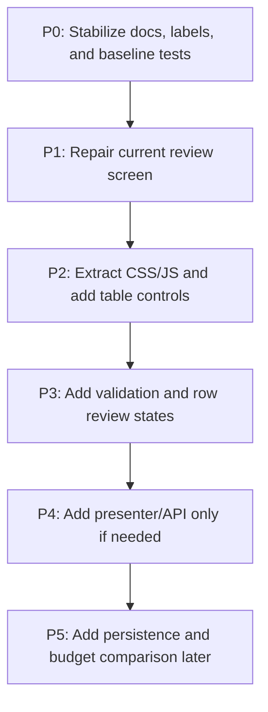

DO NOT USE FOR IMPLEMENTATION

# Airtable/Retool Forecast Review Roadmap

## Status

This is the active phased roadmap for improving MOR's forecast review workflow.

The current documentation split is:

- `docs/design/data-model.md`
- `docs/design/data-contract.md`
- `docs/design/forecast-logic.md`
- `docs/design/api-spec.md`
- `docs/design/backend-design.md`
- `docs/design/frontend-design.md`
- `docs/design/frontend-logic-architecture.md`
- `docs/workflows/codex-workflow.md`
- `docs/plans/2026-05-02-airtable-retool-frontend-implementation-plan.md`

## Execution Tracker

| Phase | Status | Notes |
| --- | --- | --- |
| P0 | Completed | Active plan/workflow/doc sources are established and readable UTF-8 labels are in use. |
| P1 | Completed | Error alert, empty state, and route/template characterization are in place. |
| P2 | Completed | CSS/JS extracted and Airtable/Retool-style table tools are active. |
| P3 | Completed | Edited/excluded/invalid row states and client-side validation are active. |
| P4 | Gated | Keep presenter/API optional until native form flow is insufficient. |
| P5 | Not started | Persistence and budget comparison remain explicitly deferred. |

## Guiding Decision

Use an Airtable-style Record Review information architecture and a Retool-style internal tool interaction model, implemented first with the existing Flask/Jinja page and small vanilla JavaScript modules.

Do not migrate to React, Next.js, shadcn/ui, TanStack Table, or a SPA unless MOR later gains multi-screen workflows, saved edit history, rich URL state, or shared chart/table state.

## Roadmap Overview



## P0: Stabilize The Source Of Truth

**Goal:** Make the active plan and docs reliable before implementation continues.

**Work:**

- Repair or replace mojibake in active user-facing labels inside plans and docs.
- Mark older corrupted plans as superseded if they cannot be trusted.
- Keep one document per concern: architecture, data model, data contract, forecast logic, API spec, roadmap, and workflow.
- Add a process rule: plans containing UI copy must use verified UTF-8 labels, not shell-corrupted output.
- Document current risks: missing formal dependency setup, inline template assets, client/server total duplication, and hidden row state risks.

**Acceptance Criteria:**

- One preferred implementation plan is clearly identifiable.
- Active UI labels are readable Chinese.
- Superseded/corrupted docs are marked or repaired.
- A future agent can find architecture, design, workflow, and implementation order in under two minutes.
- The forecast quantity formula and Excel field mapping are each documented in exactly one primary place.

## P1: Stabilize Current Review Screen

**Goal:** Make the existing page trustworthy before adding richer Airtable/Retool controls.

**Work:**

- Add route/template characterization tests.
- Repair visible labels, table headers, badges, totals, and button copy.
- Render `error_message` using `role="alert"`.
- Add a compact empty state when no rows exist and no error is present.
- Preserve the current page structure: sticky header, four metrics, scrollable table, fixed export bar.
- Keep `GET /` and `POST /export` unchanged as public routes.

**Acceptance Criteria:**

- All visible Chinese labels render correctly in the browser.
- Missing data/file errors render without a traceback.
- Empty state renders when appropriate.
- Manual quantity and exclusion still update row amount and grand total.
- `/export` rejects invalid manual quantities with HTTP 400.
- `D:\AI\python.exe -m pytest -q` passes.

## P2: Extract Assets And Add Operational Table Controls

**Goal:** Turn the working page into a maintainable Airtable/Retool-style review workspace without changing the app architecture.

**Work:**

- Move inline CSS from `templates/index.html` to `static/css/mor.css`.
- Move inline JavaScript to `static/js/forecast-table.js`.
- Add stable row attributes.
- Add a compact table action bar with search, status filter, and live counts.
- Keep filtered rows mounted in the DOM so native form export does not lose inputs.
- Keep grand total clearly defined as all mounted forecast rows unless a filtered total is explicitly labeled.

**Acceptance Criteria:**

- CSS and JS are loaded from static files.
- No behavior regression after asset extraction.
- Search and status filters work.
- Manual quantity survives filter changes.
- Exclusion survives filter changes.
- Edited/excluded counters update live.
- Server-side export still recomputes from posted form values.
- Export validation must be described consistently in docs and code.

## P3: Add Row Review States And Validation

**Goal:** Make row-level review clear and prevent obvious invalid export attempts.

**Work:**

- Toggle row classes from JavaScript.
- Add accessible labels for manual quantity and exclusion controls.
- Add client-side validation for negative and non-numeric manual quantity.
- Focus the first invalid input before export.
- Keep server-side `web/form_parser.py` validation as final authority.

**Acceptance Criteria:**

- Negative and text manual quantities are blocked client-side.
- Same invalid values still return HTTP 400 from `/export`.
- First invalid input is marked and focused.
- Excluded rows submit correctly and export amount as zero.
- `D:\AI\python.exe -m pytest -q` passes.
- UI rules for excluded rows and manual overrides match the data contract.

## P4: Presenter/API Gate

**Goal:** Add JSON support only if the table outgrows native form behavior.

**Current decision:** Add the internal presenter layer now, but keep public API endpoints gated until the UI has a clear async preview or JSON bootstrapping need.

**Work:**

- Do not add public API endpoints until the richer table UI proves it needs async preview or JSON bootstrapping.
- Keep the API contract in `docs/design/api-spec.md`, not scattered across plans.
- Create `web/forecast_presenter.py` with the JSON-safe presenter helpers when needed.
- Serialize dates as ISO strings.
- Consider `/api/forecast` and `/api/forecast/preview` only after presenter tests pass.

**Acceptance Criteria:**

- Presenter output is deterministic and JSON-safe.
- Column schema includes labels, alignment, editability, and status metadata.
- Public API endpoints remain absent until they are explicitly needed.
- Future preview totals must match `apply_user_adjustments`.
- Structured 400 responses include a machine-readable code and user-readable message.
- HTML export and any future API preview must produce matching totals for the same submitted state.

## P5: Durable Workflow And Persistence

**Goal:** Add saved monthly review workflows only when the user needs continuity beyond one export session.

**Work:**

- Formalize dependency setup with `requirements.txt` and local setup docs.
- Add draft persistence as JSON or SQLite only after explicit need.
- Improve row identity before saving state.
- Store source Excel metadata or snapshot hashes.
- Add budget workbook ingestion as a separate loader.
- Add budget/actual/forecast comparison services.

**Acceptance Criteria:**

- User can save, reopen, edit, export, and finalize a monthly draft.
- Reloaded drafts preserve manual quantities, exclusions, target month, totals, and source metadata.
- Forecast calculation remains testable without Flask or persistence.
- Export from a saved draft matches previewed backend totals.
- Architecture docs match the implemented runtime.
- Data-model and contract docs remain the source of truth for any future persistence schema.

## Verification Commands

Use these commands at each relevant phase:

```powershell
D:\AI\python.exe -m pytest tests/test_app.py -q
D:\AI\python.exe -m pytest tests/test_form_parser.py -q
D:\AI\python.exe -m pytest -q
D:\AI\python.exe -m py_compile app.py sales_forecast.py forecast_config.py forecast_models.py data_loader.py forecast_engine.py exporter.py web\form_parser.py
```

For docs-only updates, also verify that the referenced files exist and the primary docs are internally consistent.

## Execution Strategy With Subagents

For implementation, use one implementation subagent per phase or task group, not multiple writers on the same files at the same time.

## Recommended Subagent Sequence

1. P0 Docs Stabilizer
2. P1 UI Baseline Implementer
3. P2 Asset/Table Controls Implementer
4. P3 Validation Implementer
5. Spec Reviewer
6. Code Quality Reviewer

The main agent owns final integration, verification, and user-facing summary.

