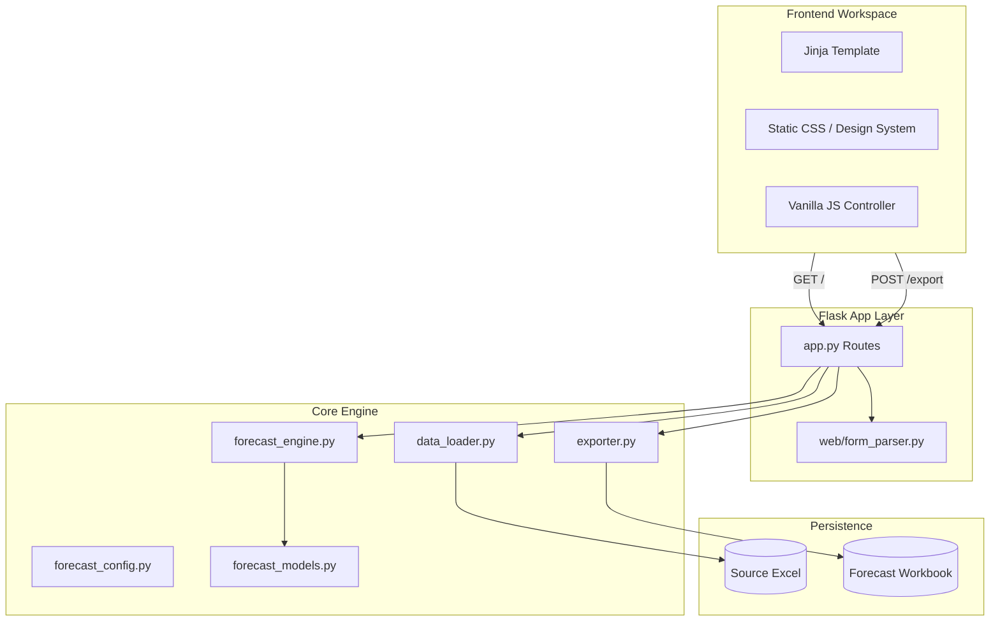

DO NOT USE FOR IMPLEMENTATION

# System Architecture

## 1. System Overview
MOR is a local, lightweight Flask-based monthly sales forecast engine. It serves as an operational decision-support tool, extracting historical sales detail data from Excel, calculating baseline forecasts, and providing a clean Airtable/Retool-style review workspace for manual adjustment and final Excel workbook export.

## 2. Core Architecture

The architecture follows a strict separation of concerns, keeping the Flask layer thin and isolating domain logic.

## 3. Component Responsibilities

| Layer | Component | Responsibility |
| --- | --- | --- |
| **Presentation** | `app.py`, `templates/` | HTTP request routing, template context injection |
| **Presentation** | `static/js`, `static/css` | Airtable/Retool style table rendering, client-side interactions |
| **Ingestion** | `data_loader.py` | Excel parsing, schema normalization, path resolution |
| **Business Logic**| `forecast_engine.py` | Cycle calculation, history metrics, mathematical totals |
| **Business Logic**| `forecast_models.py` | Data structures (ForecastRow, ForecastSummary) |
| **I/O** | `exporter.py` | Translating final state into `.xlsx` binary outputs |

## 4. Frontend Architecture (Airtable / Retool Paradigm)

The frontend uses Server-Side Rendering (SSR) via Jinja, progressively enhanced with Vanilla JavaScript to support an Airtable-style review table.
- **Server Authority**: Initial state, HTML form shapes, and final validation are driven by the backend.
- **Client Enhancement**: Table filtering, searching, row state toggling (e.g., edited, excluded), and live re-calculations are handled by an in-memory JS controller without relying on React or external SPAs.

## 5. Architectural Principles

1. **Boring & Stable Core**: No heavy ORMs or DBs unless data persistence is explicitly required. Data is ephemeral per request.
2. **Domain Isolation**: Forecast logic must be perfectly testable without Flask context.
3. **Graceful Failures**: Missing Excel files or columns result in clean UI alerts, not Python tracebacks.
4. **Deterministic Export**: The final exported Excel should exactly match the UI state submitted by the user.

