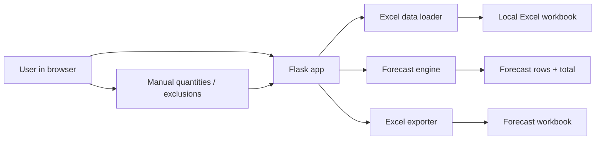

DO NOT USE FOR IMPLEMENTATION

# MOR Current Architecture

## Purpose

MOR is a local Flask tool for monthly sales forecasting. It reads Excel sales detail data, estimates likely next-month orders by customer and product, allows manual quantity overrides and exclusions, and exports the final forecast to Excel.

## Runtime Shape

## Current Modules

| Area | Current Files | Responsibility |
| --- | --- | --- |
| Web route | `app.py` | Defines `GET /` and `POST /export` |
| UI | `templates/index.html` | Single-page review table, inline CSS and JS |
| Data loading | `data_loader.py`, `sales_forecast.py` | Reads Excel and prepares columns |
| Forecast logic | `forecast_engine.py`, `forecast_models.py` | Builds typed forecast rows and summary |
| Export | `exporter.py` | Writes forecast workbook sheets |
| Form parsing | `web/form_parser.py` | Parses target month, manual quantity, exclusion fields |
| Presentation | `web/forecast_presenter.py` | Converts forecast summaries into JSON-safe review-grid payloads when present |
| Config | `forecast_config.py` | Centralizes source file, sheet, required columns, row limit, cycle window |
| Tests | `tests/` | Covers forecast, form parser, and Flask behavior |

## Data Flow

1. `GET /` loads the sales detail workbook.
2. The loader validates required columns and creates `order_date`.
3. The forecast engine groups by customer and product identity.
4. Each group calculates latest order date, average order cycle, next expected order date, recent average quantity, latest price, and estimated amount.
5. The page renders a maximum visible row set and recalculates totals client-side when the user edits quantity or exclusion.
6. `POST /export` validates the submitted reviewed state, applies form adjustments on the server, and exports Excel.

## Architectural Direction

The desired direction is a clean monolith:

- Keep Flask as a thin HTTP layer.
- Keep pandas and Excel handling outside route functions.
- Keep forecast calculation deterministic and testable without Flask.
- Keep UI behavior small and local until the interaction surface grows.
- Add persistence only when monthly version history becomes a real need.
- Keep `web/forecast_presenter.py` internal until public JSON endpoints have a concrete frontend need.
- Keep export as a validation and serialization step, not a silent recomputation of the reviewed state.

## Known Risks

- Current UI is a large single template with inline CSS and JavaScript.
- Client-side recalculation duplicates server-side adjustment logic.
- There is no persisted draft state; edits only exist until export.
- Dependency management is not fully formalized yet.
- Earlier source files showed mojibake in some shell views, so encoding should be handled carefully.
- Forecast formulas need a dedicated spec so future changes do not drift from the implementation.

## Current Process Risks

- Some older planning docs contain mojibake and should not be used as implementation source text.
- The active roadmap is `docs/roadmaps/airtable-retool-forecast-review-roadmap.md`.
- The active frontend implementation plan is `docs/plans/2026-05-02-airtable-retool-frontend-implementation-plan.md`.
- UI copy should be verified from UTF-8 source files or browser output, not copied from a corrupted shell rendering.
- The data contract is documented separately in `docs/design/data-contract.md`.
- The forecast calculation rules are documented separately in `docs/design/forecast-logic.md`.

