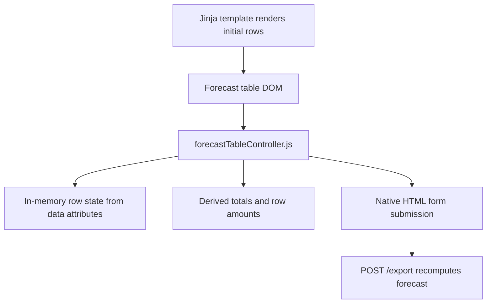

# MOR Frontend Logic Architecture Analysis

## Recommendation

For the next version, keep the frontend as server-rendered Flask/Jinja plus a small vanilla JavaScript controller. MOR is currently a single-screen operational tool; a full SPA would add complexity before the workflow needs it.

Best-fit architecture:



## Why This Fits

- Initial data comes from Excel and is naturally server-generated.
- The main user action is editing a few fields in a table, not navigating an app.
- Native form submission already matches the export workflow.
- Server recomputation remains the source of truth for Excel output.
- Vanilla JS can handle recalculation, filtering, row state, and validation without build tooling.

## Suggested Frontend Layers

### 1. Template Layer

Owns markup and server-provided values:

- Header and period form.
- Summary metric placeholders.
- Forecast table rows.
- Hidden export form fields.
- Empty and error states.

### 2. Style Layer

Move inline CSS into `static/css/mor.css` when ready. Organize by:

- Design tokens.
- Layout.
- Components.
- Table states.
- Responsive rules.

### 3. Behavior Layer

Move inline JavaScript into `static/js/forecast-table.js` when ready. Organize by:

- `readRows()`
- `calculateRowAmount(rowState)`
- `calculateTotals(rowStates)`
- `applyRowState(rowElement, rowState)`
- `bindForecastTable(formElement)`

### 4. Validation Layer

Client validation should improve feedback but not replace server validation:

- Reject negative manual quantity before export.
- Mark invalid quantity fields.
- Keep server-side `FormValidationError` as final protection.

## State Model

Each row should be represented in JS as:

```js
{
  rowId,
  price,
  autoQuantity,
  manualQuantity,
  excluded,
  amount
}
```

Derived values:

- `effectiveQuantity = manualQuantity ?? autoQuantity`
- `amount = excluded ? 0 : effectiveQuantity * price`
- `grandTotal = sum(row.amount)`

## When To Consider a Frontend Framework

Consider React, Vue, or similar only if MOR gains at least two of these:

- Saved forecast drafts with edit history.
- Multi-step review workflow.
- Rich filtering/sorting/pagination with URL state.
- Charts or comparisons that update from shared client state.
- Multiple screens beyond the forecast table.

Until then, Flask + Jinja + small JS modules is the simplest durable architecture.
