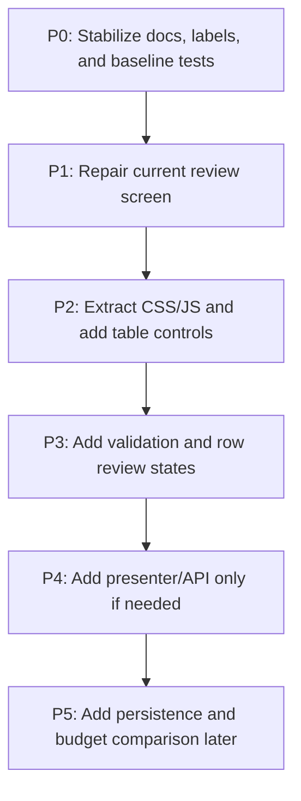

# Airtable/Retool Forecast Review Roadmap

## Status

This is the active phased roadmap for improving MOR's forecast review workflow.

The first improvement target is the forecast review screen: readable labels, reliable error states, maintainable frontend assets, and Airtable/Retool-style table controls.

Git branch creation was attempted earlier but the repository denied creating the branch ref due to filesystem permissions. Continue in the current workspace until branch creation is allowed.

## Execution Tracker (Last updated: 2026-05-02)

Use this section as the single quick checkpoint for "現在做到哪裡".

| Phase | Status | Notes |
| --- | --- | --- |
| P0 | ✅ Completed | Active plan/workflow/doc sources are established and readable UTF-8 labels are in use. |
| P1 | ✅ Completed | Error alert, empty state, and route/template characterization are in place. |
| P2 | ✅ Completed | CSS/JS extracted and Airtable/Retool-style table tools are active. |
| P3 | ✅ Completed | Edited/excluded/invalid row states and client-side validation are active. |
| P4 | ⏸️ Gated | Keep presenter/API optional until native form flow is insufficient. |
| P5 | ⏳ Not started | Persistence and budget comparison remain explicitly deferred. |

**Current execution target:** Task 8 visual/workflow verification in `docs/plans/2026-05-02-airtable-retool-frontend-implementation-plan.md`.

## Guiding Decision

Use an **Airtable-style Record Review** information architecture and a **Retool-style internal tool** interaction model, implemented first with the existing Flask/Jinja page and small vanilla JavaScript modules.

Do not migrate to React, Next.js, shadcn/ui, TanStack Table, or a SPA unless MOR later gains multi-screen workflows, saved edit history, rich URL state, or shared chart/table state.

## Roadmap Overview



## P0: Stabilize The Source Of Truth

**Goal:** Make the active plan and docs reliable before implementation continues.

**Work:**

- Repair or replace mojibake in active user-facing labels inside plans and docs.
- Mark older corrupted plans as superseded if they cannot be trusted.
- Confirm `docs/plans/2026-05-02-airtable-retool-frontend-implementation-plan.md` is the active implementation plan.
- Add a process rule: plans containing UI copy must use verified UTF-8 labels, not shell-corrupted output.
- Document current risks: missing formal dependency setup, inline template assets, client/server total duplication, and hidden row state risks.

**Dependencies:**

- `AGENTS.md`
- `DESIGN.md`
- `docs/workflows/codex-workflow.md`
- `docs/plans/2026-05-02-airtable-retool-frontend-implementation-plan.md`

**Risks:**

- Copying shell-displayed mojibake into source files or tests.
- Multiple docs appearing equally authoritative.

**Acceptance Criteria:**

- One preferred implementation plan is clearly identifiable.
- Active UI labels are readable Chinese.
- Superseded/corrupted docs are marked or repaired.
- A future agent can find architecture, design, workflow, and implementation order in under two minutes.

## P1: Stabilize Current Review Screen

**Goal:** Make the existing page trustworthy before adding richer Airtable/Retool controls.

**Work:**

- Add route/template characterization tests.
- Repair visible labels, table headers, badges, totals, and button copy.
- Render `error_message` using `role="alert"`.
- Add a compact empty state when no rows exist and no error is present.
- Preserve the current page structure: sticky header, four metrics, scrollable table, fixed export bar.
- Keep `GET /` and `POST /export` unchanged as public routes.

**Dependencies:**

- Current Flask/Jinja form workflow.
- Existing tests in `tests/test_app.py`, `tests/test_forecast.py`, and `tests/test_form_parser.py`.
- Current backend domain model: `ForecastSummary` and `ForecastRow`.

**Risks:**

- Tests asserting corrupted strings instead of intended Chinese labels.
- Friendly errors being passed from `app.py` but not rendered.
- Excel being reloaded between review and export, which can change results if the source file changes.

**Acceptance Criteria:**

- All visible Chinese labels render correctly in the browser.
- Missing data/file errors render without a traceback.
- Empty state renders when appropriate.
- Manual quantity and exclusion still update row amount and grand total.
- `/export` rejects invalid manual quantities with HTTP 400.
- `D:\AI\python.exe -m pytest -q` passes.

## P2: Extract Assets And Add Operational Table Controls

**Goal:** Turn the working page into a maintainable Airtable/Retool-style review workspace without changing the app architecture.

**Work:**

- Move inline CSS from `templates/index.html` to `static/css/mor.css`.
- Move inline JavaScript to `static/js/forecast-table.js`.
- Add stable row attributes:
  - `data-row-id`
  - `data-status`
  - `data-search`
  - `data-price`
  - `data-auto-qty`
- Add a compact table action bar:
  - search by customer/product code/product name
  - status filter for all, auto, not-due, edited, excluded
  - visible, edited, and excluded counts
- Keep filtered rows mounted in the DOM so native form export does not lose inputs.
- Keep grand total clearly defined as all mounted forecast rows unless a filtered total is explicitly labeled.

**Dependencies:**

- P1 complete.
- Static asset directories available.
- Design rules in `DESIGN.md`.

**Risks:**

- Hidden filtered rows losing manual quantity or exclusion state.
- Client-side total drifting from server-side export total.
- Search/filter state confusing total semantics.
- Static JS loading successfully in HTML but failing at runtime.

**Acceptance Criteria:**

- CSS and JS are loaded from static files.
- No behavior regression after asset extraction.
- Search and status filters work.
- Manual quantity survives filter changes.
- Exclusion survives filter changes.
- Edited/excluded counters update live.
- Server-side export still recomputes from posted form values.

## P3: Add Row Review States And Validation

**Goal:** Make row-level review clear and prevent obvious invalid export attempts.

**Work:**

- Toggle row classes from JavaScript:
  - `.edited`
  - `.excluded`
  - `.invalid`
- Add accessible labels for manual quantity and exclusion controls.
- Add client-side validation for negative and non-numeric manual quantity.
- Focus the first invalid input before export.
- Keep server-side `web/form_parser.py` validation as final authority.
- Add tests for server/client parity where possible.

**Dependencies:**

- P2 complete.
- Existing form parser behavior remains unchanged.

**Risks:**

- Browser number inputs allowing odd intermediate values.
- Client validation diverging from `parse_manual_quantities`.
- Invalid hidden rows blocking export without a clear focus path.

**Acceptance Criteria:**

- Negative and text manual quantities are blocked client-side.
- Same invalid values still return HTTP 400 from `/export`.
- First invalid input is marked and focused.
- Excluded rows submit correctly and export amount as zero.
- `D:\AI\python.exe -m pytest -q` passes.

## P4: Presenter/API Gate

**Goal:** Add JSON support only if the table outgrows native form behavior.

**Current decision:** Add the internal presenter layer now, but keep public API endpoints gated until the UI has a clear async preview or JSON bootstrapping need.

**Work:**

- Do not add public API endpoints until the richer table UI proves it needs async preview or JSON bootstrapping.
- Create `web/forecast_presenter.py` with:
  - `serialize_summary(summary) -> dict`
  - `column_schema() -> list[dict]`
- Serialize dates as ISO strings.
- Consider endpoints only after presenter tests pass:
  - `GET /api/forecast`
  - `POST /api/forecast/preview`
- Keep `/export` stateless and form-compatible unless explicitly replaced.
- Share adjustment parsing rules between form and JSON paths to avoid validation drift.

**Dependencies:**

- P2/P3 stable.
- A clear UI need for async preview or column metadata.
- Presenter tests written first.

**Risks:**

- Premature API work duplicating forecast logic.
- Date serialization leaking Python `date` objects.
- Preview totals diverging from export totals.
- Returning all rows exceeding current `visible_row_limit` assumptions.

**Acceptance Criteria:**

- Presenter output is deterministic and JSON-safe.
- Column schema includes labels, alignment, editability, and status metadata.
- Public API endpoints remain absent until they are explicitly needed.
- Future preview totals must match `apply_user_adjustments`.
- Structured 400 responses include a machine-readable code and user-readable message.
- HTML export and any future API preview must produce matching totals for the same submitted state.

## P5: Durable Workflow And Persistence

**Goal:** Add saved monthly review workflows only when the user needs continuity beyond one export session.

**Current decision:** Formalize dependency setup now; keep persistence gated until explicitly needed.

**Work:**

- Formalize dependency setup with `requirements.txt` and local setup docs.
- Add draft persistence as JSON or SQLite only after explicit need.
- Improve row identity before saving state; avoid relying only on `customer__product_code`.
- Store source Excel metadata or snapshot hashes.
- Add budget workbook ingestion as a separate loader.
- Add budget/actual/forecast comparison services.

**Dependencies:**

- Stable row identity strategy.
- Decision between JSON files and SQLite.
- Product decision on local single-user versus future multi-user use.

**Risks:**

- Persistence introduces migration, locking, backup, and stale-source concerns.
- Saved drafts can conflict with changed Excel source data.
- Budget comparisons can blur module boundaries if not kept separate.

**Acceptance Criteria:**

- User can save, reopen, edit, export, and finalize a monthly draft.
- Reloaded drafts preserve manual quantities, exclusions, target month, totals, and source metadata.
- Forecast calculation remains testable without Flask or persistence.
- Export from a saved draft matches previewed backend totals.
- Architecture docs match the implemented runtime.

## Verification Commands

Use these commands at each relevant phase:

```powershell
D:\AI\python.exe -m pytest tests/test_app.py -q
D:\AI\python.exe -m pytest tests/test_form_parser.py -q
D:\AI\python.exe -m pytest -q
D:\AI\python.exe -m py_compile app.py sales_forecast.py forecast_config.py forecast_models.py data_loader.py forecast_engine.py exporter.py web\form_parser.py
```

For browser verification:

```powershell
D:\AI\python.exe app.py
```

Open:

```text
http://127.0.0.1:5000/
```

Verify in one browser session:

- Chinese labels render correctly.
- Missing-file error renders as an alert.
- Search filters rows without losing input values.
- Status filter works.
- Manual quantity updates row amount and grand total.
- Excluding a row mutes it and sets amount to 0.
- Edited/excluded counters update.
- Export still downloads Excel.
- Invalid manual quantity is blocked client-side and rejected server-side.

## Execution Strategy With Subagents

For implementation, use one implementation subagent per phase or task group, not multiple writers on the same files at the same time.

Recommended subagent sequence:

1. **P0 Docs Stabilizer:** repair active docs and label source of truth.
2. **P1 UI Baseline Implementer:** tests, labels, error/empty states.
3. **P2 Asset/Table Controls Implementer:** CSS/JS extraction and filters.
4. **P3 Validation Implementer:** row states and client validation.
5. **Spec Reviewer:** verify each phase matches this roadmap.
6. **Code Quality Reviewer:** review maintainability, test coverage, and regressions.

The main agent owns final integration, verification, and user-facing summary.
