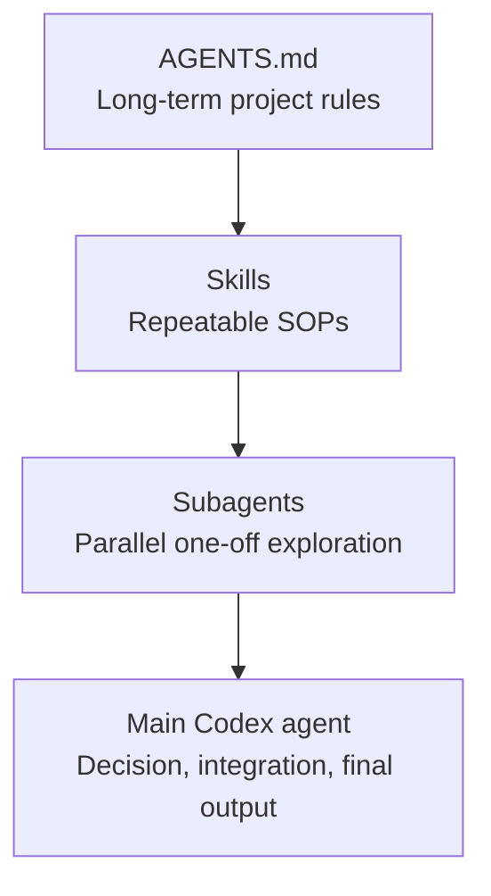

# Codex Workflow For MOR

## Purpose

This document defines how to use Codex, project docs, skills, and subagents for MOR work. It turns repeatable behavior into a stable workflow so future tasks start with less ambiguity.

## Three-Layer Model



## Layer 1: AGENTS.md

Use `AGENTS.md` for project-wide rules:

- Setup and test commands.
- Project structure.
- Coding style.
- UI design guardrails.
- Documentation expectations.
- Safety rules.
- When subagents are appropriate.

Codex should treat this as the first local operating manual for MOR.

## Layer 2: Skills

Use skills for fixed SOPs. Good candidates for MOR:

- Excel forecast validation.
- Flask route debugging.
- Frontend table design review.
- Design-doc generation.
- Export workbook QA.

Skills are best when the same checklist will be reused many times.

## Layer 3: Subagents

Use subagents for large, noisy, parallel exploration. Subagents should not own final product decisions; the main agent should integrate their findings.

Recommended MOR subagent set:

| Role | Focus |
| --- | --- |
| Codebase Explorer | Structure, module boundaries, data flow |
| Bug Hunter | Runtime errors, edge cases, encoding, Excel failures |
| Test Writer | Missing tests, regression cases, fixture strategy |
| Refactor Planner | Incremental migration plan and risk |
| Docs Updater | Stale docs, missing README/design/architecture notes |

## Standard Subagent Prompt

Use this when the user asks for broad exploration:

```text
Use parallel subagents for this MOR task.

Spawn one subagent for each area:
1. Codebase structure and architecture
2. Potential bugs and edge cases
3. Test coverage gaps
4. Refactoring opportunities
5. Documentation and README updates

Each subagent should inspect only its own area and return:
- Key findings
- Relevant files
- Suggested actions
- Risk level

Wait for all subagents to finish, then summarize the results into:
1. Immediate fixes
2. Medium-priority improvements
3. Optional cleanup
4. Recommended implementation order
```

## PR Review Prompt

```text
Review the current branch against main using parallel subagents.

Spawn one subagent per review topic:
1. Security risks
2. Runtime bugs
3. Code quality
4. Test flakiness
5. Maintainability
6. Performance

Wait for all agents to complete.
Return a consolidated review with:
- Critical issues
- Suggested patches
- Files involved
- Whether this PR is safe to merge
```

## Bug Investigation Prompt

```text
Use subagents to investigate this MOR bug in parallel.

Spawn:
1. One agent to trace the error path
2. One agent to inspect recent related changes
3. One agent to inspect tests and reproduction steps
4. One agent to propose a minimal fix

Do not modify files yet.
Wait for all agents, then give:
- Most likely root cause
- Evidence
- Minimal fix plan
- Files to change
- Tests to run
```

## Feature Planning Prompt

```text
Use subagents to plan this MOR feature before editing code.

Spawn:
1. Architecture agent: find where this feature should fit
2. UI agent: inspect existing components and styles
3. API agent: inspect backend routes and data flow
4. Test agent: identify required tests
5. Risk agent: identify breaking changes

Wait for all results.
Then produce a step-by-step implementation plan.
Do not write code until the plan is approved.
```

## Task Size Guide

| Task Size | Recommended Workflow |
| --- | --- |
| Small | Main agent inspects related files, edits, tests |
| Medium | Main agent creates a short plan, edits in batches, tests |
| Large | Subagents explore, main agent integrates, then phased implementation |
| Repeated | Convert into a skill |
| Long-term rule | Add to `AGENTS.md` |

## MOR-Specific Notes

- For UI work, read `DESIGN.md` first.
- For architecture and roadmap work, use `infrastructure/project_architecture_and_implementation_plan.md`.
- For API behavior, use `infrastructure/api/api_spec.md`.
- For data model and persistence decisions, use `infrastructure/backend/database_schema.md`.
- For architecture decisions, use `infrastructure/adr/`.
- For local setup, verification, and Codex operating rules, use `docs/workflows/`.
- Do not use `docs/archive/` or any `superseded-*` file as implementation context.
- For any Excel behavior change, add or update tests before implementation.
- For broad roadmap, architecture, or risk exploration, use subagents first and have the main agent integrate the final decision.

## UI Copy And Encoding Rule

Never copy user-visible Chinese labels from shell output if the terminal rendering looks corrupted. Verify UI copy from UTF-8 source files, browser output, or a Python/PowerShell character-code check before adding it to templates, tests, or plans.

## Solo Developer Workflow

When the work is being done by one person at a time, prefer this cadence:

1. Pick one small task.
2. Make the smallest working change.
3. Run the relevant tests.
4. Commit while the change is still easy to reason about.
5. Keep `main` usable at the end of the session.
6. Reserve feature branches for larger refactors or parallel work.
