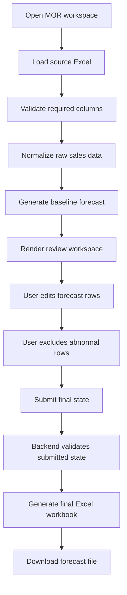
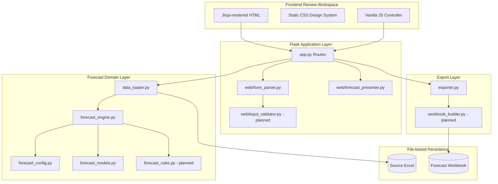
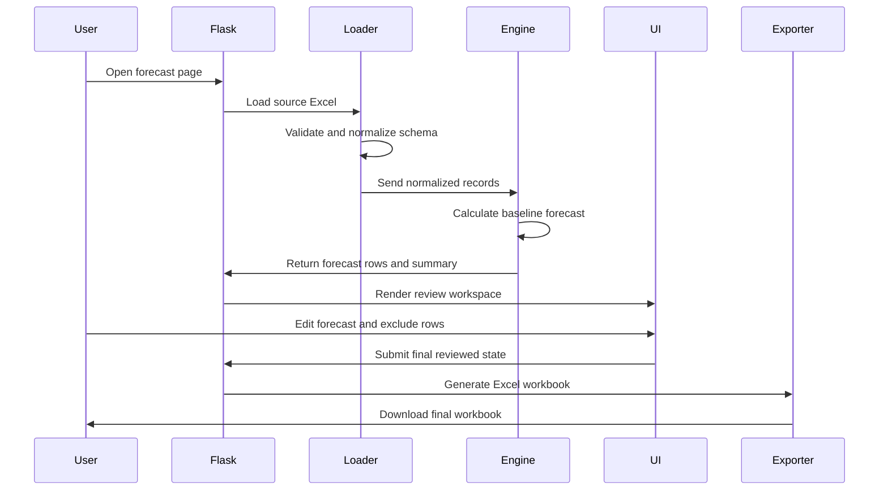

# MOR Monthly Sales Forecast Engine
# Project Architecture & Implementation Plan

## 1. Project Purpose

MOR is a local monthly sales forecast engine designed for sales planning, order review, and Excel-based operational reporting.

The system converts historical sales detail data from Excel into a structured forecast workspace, allowing users to review baseline predictions, manually adjust assumptions, exclude abnormal records, and export a final forecast workbook.

## 2. Business Goal

The goal is to reduce manual Excel forecasting work and create a repeatable monthly planning process.

### Core business outcomes

1. Convert historical sales data into forecast-ready rows.
2. Generate baseline monthly forecast suggestions.
3. Allow manual review and adjustment before final output.
4. Export a clean Excel workbook for internal reporting.
5. Keep the system lightweight, local, and easy to maintain.

## 3. Success Criteria

### Functional success

1. User can upload or load source Excel data.
2. System can normalize hospital, product, date, and quantity fields.
3. System can calculate baseline forecast values.
4. User can adjust forecast rows in the UI.
5. User can exclude abnormal rows.
6. Exported Excel must match the final reviewed UI state.

### Operational success

1. Forecast logic can be tested without running Flask.
2. Missing columns or wrong file formats return user-friendly error messages.
3. No Python traceback should appear in the user interface.
4. Export output must be deterministic.
5. The system should remain usable without database dependency in the first version.

## 4. Project Scope

### In Scope

1. Excel data ingestion.
2. Schema normalization.
3. Monthly sales history calculation.
4. Baseline forecast calculation.
5. Manual adjustment workspace.
6. Row exclusion and edited-state tracking.
7. Final Excel export.
8. Basic error handling.
9. Unit tests for core forecast logic.

### Out of Scope for Version 1

1. User login.
2. Multi-user collaboration.
3. Cloud database.
4. Real-time dashboard.
5. Automated email delivery.
6. API integration with ERP or CRM.
7. Advanced machine learning forecast models.

These can be added after the core monthly workflow is stable.

## 5. Architecture Principles

The design follows five principles adapted from common well-architected frameworks: operational clarity, reliability, performance efficiency, cost control, and security awareness.

### 5.1 Boring and Stable Core

Use simple, predictable technologies first.

Current choice:

1. Flask
2. Jinja
3. Vanilla JavaScript
4. Excel input and output
5. No database in Version 1

### 5.2 Thin Web Layer

Flask should only handle routing, request parsing, template rendering, and response delivery.

Forecast calculation should stay outside Flask.

### 5.3 Domain Isolation

Forecast logic must be testable as pure Python functions.

The forecast engine should not depend on:

1. Flask request object
2. Jinja template
3. Browser state
4. File upload mechanism

### 5.4 Deterministic Output

The exported workbook must reflect the final submitted state exactly.

The system should avoid hidden recalculation after user submission unless explicitly designed.

### 5.5 Progressive Enhancement

The backend remains the source of truth.

JavaScript improves user experience through filtering, searching, live totals, and row-state display.

## 6. Target User Workflow



## 7. System Architecture

This diagram is the target architecture for the monthly operating version.
The implementation has been resolved to use `src/backend/` as the canonical backend path.



## 8. Component Responsibilities

### 8.1 Frontend Layer

#### templates/

Responsible for:

1. Rendering initial forecast table.
2. Displaying summary cards.
3. Showing validation alerts.
4. Providing export form structure.

Should avoid:

1. Business calculation logic.
2. Complex conditional rules.
3. Hidden forecast formulas.

#### static/js/

Responsible for:

1. Table search.
2. Table filtering.
3. Row edit tracking.
4. Row exclusion toggling.
5. Live UI totals.
6. Preparing final form submission.

Should avoid:

1. Replacing backend validation.
2. Becoming a second forecast engine.
3. Holding logic that cannot be reproduced by backend.

#### static/css/

Responsible for:

1. Airtable or Retool-style interface.
2. Table layout.
3. Status badges.
4. Error and warning states.
5. Responsive workspace styling.

## 9. Backend Layer

### 9.1 app.py

Responsible for:

1. Route registration.
2. Calling service functions.
3. Passing clean data into templates.
4. Handling export request.
5. Returning downloadable Excel files.

Should stay thin.

### 9.2 web/form_parser.py

Responsible for:

1. Reading submitted form data.
2. Converting string values into typed values.
3. Building clean ForecastRow inputs.
4. Preserving edited and excluded row state.

### 9.3 web/input_validator.py

Responsible for:

1. Checking required submitted fields.
2. Detecting invalid numbers.
3. Detecting missing row identifiers.
4. Returning structured validation errors.

### 9.4 web/forecast_presenter.py

Responsible for:

1. Converting forecast summaries into JSON-safe grid payloads.

**API Gate Decision:**
現在新增 presenter。但不新增 `/api/*` public endpoints。

## 10. Domain Layer

### 10.1 forecast_config.py

Responsible for:

1. Required Excel column names.
2. Product mapping.
3. Hospital mapping.
4. Forecast period settings.
5. Default calculation parameters.

### 10.2 data_loader.py

Responsible for:

1. Loading Excel files.
2. Validating required columns.
3. Standardizing column names.
4. Cleaning empty rows.
5. Converting date and quantity fields.
6. Returning normalized records.

### 10.3 forecast_engine.py

Responsible for:

1. Grouping sales history by hospital, product, and month.
2. Calculating historical averages.
3. Calculating recent sales trends.
4. Producing baseline forecast values.
5. Generating forecast summaries.

**Forecast Quantity Rules:**
1. 若 `next_order_date` 落在 `target_month`：
   `forecast_quantity = recent_average_quantity`
2. `recent_average_quantity`:
   取最近 N 次有效訂單數量的中位數或平均數 (N 由 `forecast_config.py` 控制)
3. 若歷史不足：
   `forecast_quantity = last_order_quantity`
   `forecast_basis = "fallback_latest_order"`
4. 若不在 `target_month`：
   `forecast_quantity = 0`
   `forecast_basis = "not_due"`
5. 若異常大單：
   不自動排除，但標記 `warning_status = "possible_outlier"`

### 10.4 forecast_rules.py

Responsible for:

1. Exclusion rules.
2. Abnormal value detection.
3. Default adjustment rules.
4. Future rule expansion.

### 10.5 forecast_models.py

Responsible for:

1. ForecastRow
2. ForecastSummary
3. ValidationResult
4. ExportPayload

Models should be explicit and typed.

## 11. Export Layer

### 11.1 exporter.py

Responsible for:

1. Receiving final reviewed forecast state.
2. Calling workbook builder.
3. Returning binary Excel output.

**Export Rule:**
Server-side export recalculates effective quantities and amounts from posted form values, but must not regenerate baseline forecast rows.

### 11.2 workbook_builder.py

Responsible for:

1. Creating workbook tabs.
2. Writing forecast rows.
3. Writing summary tables.
4. Applying basic formatting.
5. Ensuring output order is stable.

## 12. Data Flow



## 13. Data Contract

### 13.1 Source Excel Required Fields

The data contract separates raw Excel columns from normalized domain fields.
Raw workbook labels may be Chinese and must be preserved in source and export
behavior. Documentation should describe their meaning without copying corrupted
terminal output.

Minimum semantic fields:

1. Customer or hospital name.
2. Product code.
3. Product display name.
4. Sales year, month, and day.
5. Quantity.
6. Unit price or sales amount.

Normalized domain fields:

1. `customer`
2. `product_code`
3. `product_name`
4. `order_date`
5. `quantity`
6. `latest_price`
7. `year`
8. `month`

Optional semantic fields:

1. Customer code.
2. Department.
3. Doctor.
4. Sales representative.
5. Channel.
6. Remarks.

### 13.2 Forecast Row Fields

Each forecast row should contain:

1. row_id
2. hospital
3. product
4. forecast_month
5. historical_quantity
6. baseline_forecast
7. adjusted_forecast
8. adjustment_reason
9. is_excluded
10. edited_by_user
11. warning_status

### 13.3 Data Contract Clarifications

Current `row_id` implementation uses:

`row_id = customer + "__" + product_code`

Target row identity rules:

1. Prefer a stable customer code when source data provides one.
2. Fall back to normalized customer name.
3. Combine the customer key with `product_code`.
4. Do not use `product_name` as identity because it is a display label and can change.
5. Keep generated row IDs deterministic so submitted review state and exported workbooks match.

The implementation roadmap must either preserve the current readable row ID for
Version 1 or migrate to a hashed/stable ID with regression tests for form submit
and export behavior.

## 14. Error Handling Design

### 14.1 Excel File Errors

Examples:

1. File not found.
2. Wrong file type.
3. Required column missing.
4. Empty worksheet.
5. Invalid date format.
6. Invalid quantity value.

Expected behaviour:

1. Return structured error object.
2. Display clean UI alert.
3. Avoid Python traceback in browser.
4. Allow user to correct input and retry.

### 14.2 Forecast Calculation Errors

Examples:

1. No historical sales.
2. Product mapping not found.
3. Hospital mapping not found.
4. Division by zero.
5. Negative quantity.

Expected behaviour:

1. Mark row with warning.
2. Continue processing valid rows.
3. Show summary of skipped or warning rows.

## 15. Testing Plan

Current automated coverage:

1. Forecast engine unit tests.
2. Form parser unit tests.
3. Forecast presenter serialization tests.
4. Flask route smoke tests.

Known coverage gaps:

1. Excel loader fixtures for required columns, missing columns, invalid dates, and Chinese labels.
2. Successful `/export` route test with workbook readback.
3. Workbook sheet names, column order, included/excluded rows, manual quantities, and totals.
4. Multi-customer and multi-product forecast edge cases.
5. Browser-level smoke tests for search, filter, manual quantity, row exclusion, and live totals.
6. Encoding checks for user-visible Chinese labels in source files, browser output, and exported workbook.

### 15.1 Unit Tests

Test modules:

1. data_loader.py
2. forecast_engine.py
3. forecast_rules.py, when introduced
4. exporter.py
5. form_parser.py

**Test Fixtures Requirement:**
Must use real Excel fixtures managed in `tests/fixtures/`:
- `sales_detail_minimal.xlsx`
- `sales_detail_missing_columns.xlsx`
- `sales_detail_outlier.xlsx`
- `sales_detail_duplicate_latest_date.xlsx`
- `sales_detail_chinese_columns.xlsx`

### 15.2 Core Test Cases

1. Valid Excel input.
2. Missing required column.
3. Empty Excel file.
4. Invalid date format.
5. Product with no history.
6. Hospital with multiple products.
7. Manual adjustment submitted correctly.
8. Excluded row excluded from summary.
9. Export workbook matches submitted UI state.

### 15.3 Regression Tests

Each monthly update should test:

1. Same input creates same output.
2. Same reviewed state creates same workbook.
3. Column order remains stable.
4. Summary total equals row-level total.
5. UI-visible totals match exported workbook totals.
6. Hidden, paginated, or unrendered rows cannot silently change export totals.

### 15.4 Verification By Roadmap Phase

1. Baseline documentation or route work: run `D:\AI\python.exe -m pytest -q`.
2. Import or module path work: run `D:\AI\python.exe -m py_compile app.py src\backend\app.py src\backend\sales_forecast.py src\backend\forecast_config.py src\backend\forecast_models.py src\backend\data_loader.py src\backend\forecast_engine.py src\backend\exporter.py src\backend\web\form_parser.py src\backend\web\forecast_presenter.py`.
3. Forecast rule work: run focused forecast tests plus the full suite.
4. Export work: add workbook readback tests with `openpyxl`, then run the full suite.
5. Frontend interaction work: run route tests, start the local server, and complete the browser checklist in `docs/workflows/local-setup.md`.

## 16. Version Roadmap

### Current Architecture Priorities

Before adding larger backend features, MOR will prioritize the UI/UX refactor to establish a professional "Modern Data Workbench" environment:

1. **Phase 1 UI Refactor**: Implement the new design system (tokens) and layout structure.
2. **Phase 2 UI Refactor**: Optimize the core data grid (table) for density and clarity.
3. **Choose one canonical backend module path**: (Resolved to `src/backend/`).
4. **Fix export authority**: (Resolved).
5. **Align active documentation**: (In progress).

Current progress:

1. `/export` rejects submitted manual or excluded row IDs that are not present in the regenerated forecast summary.
2. The review page carries an unrendered-row baseline total so browser recalculation preserves totals for rows hidden by `visible_row_limit`.
3. The review page submits a forecast signature so `/export` can reject stale exports when the regenerated baseline no longer matches the reviewed baseline.

### Version 0.1: Working Prototype

Goal:

Create the first usable local workflow.

Status: mostly complete.

Deliverables:

1. Load fixed Excel file.
2. Generate forecast table.
3. Display Jinja page.
4. Export basic Excel workbook.

### Version 0.2: Review Workspace (UI Priority)

Goal:

Make the UI professional and useful for monthly review using the "Modern Data Workbench" style.

Status: **Immediate Focus.**

Deliverables:

1. Search and filter.
2. Editable forecast quantity.
3. Exclude row toggle.
4. Live total summary.
5. Adjustment reason field.

Architecture notes:

1. Decide whether `web/forecast_presenter.py` feeds a future JSON API or remains a testable presenter for SSR data.
2. Ensure visible row limits do not make summary totals misleading.
3. Keep JavaScript as preview behavior; backend validation remains authoritative.

### Version 0.3: Validation and Error Handling

Goal:

Make the system stable for real monthly use.

Status: planned.

Deliverables:

1. Required column validation.
2. Clean error messages.
3. Abnormal value warnings.
4. Invalid submission detection.

Architecture notes:

1. Introduce `web/input_validator.py` only when validation exceeds `web/form_parser.py`.
2. Add structured validation errors before adding new routes or APIs.
3. Keep Chinese UI copy sourced from UTF-8 files, not terminal output.

### Version 0.4: Export Quality

Goal:

Make exported workbook suitable for internal reporting.

Status: planned.

Deliverables:

1. Styled Excel output.
2. Summary tab.
3. Detail tab.
4. Excluded row tab.
5. Metadata tab.

Architecture notes:

1. Export must use the submitted reviewed state as the authority.
2. Export may recalculate effective quantity and amount from submitted values.
3. Export must not silently replace user-reviewed baseline rows with a new forecast.
4. Add workbook readback tests before changing sheet structure or labels.

### Version 1.0: Monthly Operating Version

Goal:

Make MOR reliable enough for repeated monthly use.

Status: planned.

Deliverables:

1. Full review workflow.
2. Stable forecast rules.
3. Tested export.
4. Clear folder structure.
5. Basic user guide.
6. Sample data and test workbook.

Exit criteria:

1. One canonical backend implementation path.
2. No active workflow doc points to archived or deleted roadmap files.
3. Full test suite, syntax check, browser checklist, and export workbook inspection pass.
4. Core architecture decisions are captured in ADRs.

## 17. Suggested Folder Structure

```text
mor/
  app.py
  requirements.txt
  README.md

  config/
    forecast_config.py

  domain/
    forecast_engine.py
    forecast_models.py
    forecast_rules.py

  ingestion/
    data_loader.py
    schema_validator.py

  web/
    form_parser.py
    input_validator.py

  export/
    exporter.py
    workbook_builder.py

  templates/
    index.html
    error.html

  static/
    css/
      app.css
    js/
      forecast_table.js

  data/
    source/
    output/
    sample/

  tests/
    test_data_loader.py
    test_forecast_engine.py
    test_form_parser.py
    test_exporter.py
```

## 18. Architecture Decision Records

### ADR-001: Use Flask and Jinja for Version 1

Decision:

Use Flask and Jinja for the first version.

Reason:

1. The system is local.
2. The workflow is simple.
3. Server-rendered HTML is enough.
4. Development speed is higher.
5. No SPA complexity is needed.

### ADR-002: Avoid Database in Version 1

Decision:

Do not introduce a database in Version 1.

Reason:

1. Data is monthly and file-based.
2. Excel remains the operational source.
3. Persistence is not yet required.
4. Local deployment should stay simple.

Future trigger for database:

1. Multi-user review.
2. Long-term audit trail.
3. Login and permission control.
4. Forecast version history.

### ADR-003: Keep Forecast Logic Outside Flask

Decision:

Forecast logic must live in the domain layer.

Reason:

1. Easier testing.
2. Easier maintenance.
3. Lower coupling.
4. Easier future migration to API or desktop app.

## 19. Key Risks

### Risk 1: Excel Format Changes

Impact:

High.

Mitigation:

1. Centralize column mapping.
2. Add required column validation.
3. Add sample file template.
4. Show missing column alerts.

### Risk 2: Frontend Calculation Differs from Backend

Impact:

High.

Mitigation:

1. Backend remains final authority.
2. JavaScript only handles preview totals.
3. Backend validates final submitted state.

### Risk 3: Forecast Formula Becomes Hard to Maintain

Impact:

Medium.

Mitigation:

1. Separate forecast_rules.py.
2. Add tests for each formula.
3. Document calculation assumptions.

### Risk 4: Export Workbook Does Not Match UI

Impact:

High.

Mitigation:

1. Submit full reviewed state.
2. Add export regression tests.
3. Compare UI total and export total.

## 20. Final Architecture Summary

MOR should be designed as a local, file-based, review-first forecasting tool.

The first version should prioritize:

1. Clean Excel ingestion.
2. Stable forecast calculation.
3. Simple manual review UI.
4. Deterministic Excel export.
5. Strong testability.
6. Clear separation between web, domain, ingestion, and export layers.

Future versions can add database, login, audit trail, dashboard, and ERP or CRM integration after the monthly workflow is proven stable.
